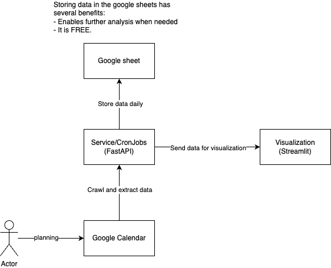

# Roadmaps
## Tracking features
Tracking:
- Works 
- Leasures 
- Training 
- Sleeping
- Foods
- Reading

## Analytic features
### Basic features
- Comparing the performance to previous day/week/month/year
- Showing the progress (big picture)

### Advanced features
- Suggesting action(s) to improve: LLM?

# Tech stack && System Design
## Tech stack
- API development: FastAPI
- Visualization: Streamlit
- Database: 
    - Google Calendar
    - Google Sheet
- Analyzing tool: Google colab :) 

## Design
[Flow Diagram](https://app.diagrams.net/#G1B2MpEcyPrh5j9W9feV6m8QFUuA19ungN#%7B%22pageId%22%3A%22Dq6N4hXfuKxIBMVxT1W8%22%7D)

## Deployment
- Try to find some free credits from my connections

